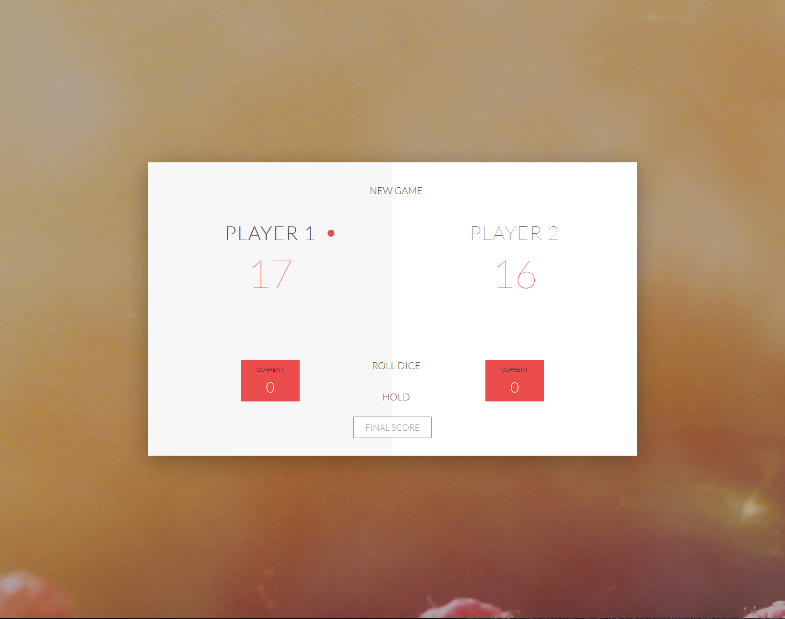

# The Pig Game Web App
> A dice game web app with two players, playing in rounds.

## Table of contents
* [General info](#general-info)
* [Screenshots](#screenshots)
* [Technologies](#technologies)
* [Setup](#setup)
* [Features](#features)
* [Status](#status)
* [Inspiration](#inspiration)
* [Contact](#contact)

## General info
The goal of this project is to show my portifolio to the world.

## Screenshots

## Technologies
* Brackets
* HTML
* CSS
* JavaScript

## Setup
Since it was a simple app, there was not much setup required.

## Features
Features ready:
* Roll the dice

To-do list:
* None

## Status
Project is: _finished_

## Inspiration
Project based on online course I took with Udemy.

## Contact
Created by Julius Mushi - feel free to contact me!
